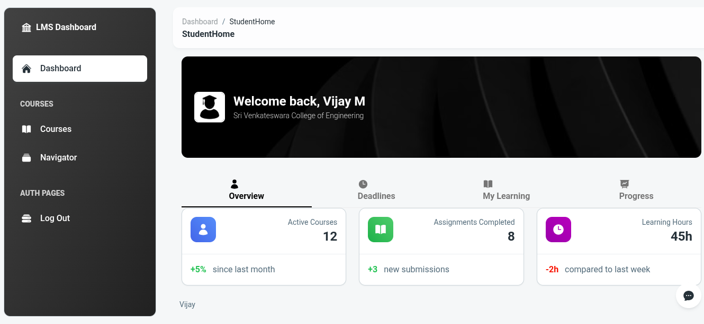

Role-Based LMS Dashboard with Chatbot
Description

A frontend Learning Management System (LMS) built with React + Tailwind CSS, featuring role-based dashboards, a role-aware chatbot, and inline charting.

Admin Dashboard → Manage and monitor learners with stats, charts, and completion reports.

Student Dashboard → Track learning progress, upcoming deadlines, quizzes, and achievements.

Chatbot → Role-specific static Q&A with in-chat chart rendering.

Responsive → Works seamlessly across mobile, tablet, and desktop.

This project is part of a Frontend Engineer Assignment.

Admin Dashboard  Preview:

Student Dashboard Preview:

FAQ bot Preview:

Installation:
    Requirements
        1.Node.js (>=16)
        2.npm or yarn
    
    # Clone repository
    git clone https://github.com/Vijay8426/LMS-Dashboard.git
    cd lms-dashboard

    # Install dependencies
    npm install

    # Run in development mode
    npm run dev

    # Build for production
    npm run build

Usage:

    1.On launch, you’ll see a role selection screen.

    2.Select Admin or Student to log in (mock authentication).

    3.Depending on your role, the dashboard view changes.

    3.Click the Chatbot button to open a modal.

    4.Ask static Q&A (role-specific).

    5.Certain queries render charts inline.